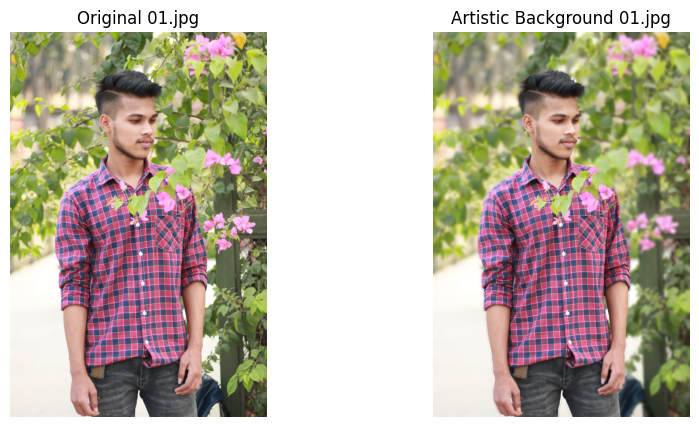

# Artistic Background Blurring in Portrait Photography

## Introduction
In portrait photography, the background often distracts from the subject, reducing the aesthetic appeal of the image. Traditionally, photographers blur the background using manual techniques like aperture control or post-processing tools. In recent years, computer vision has provided powerful tools for automating background manipulation. The application of image segmentation and blurring techniques not only streamlines this process but also introduces creative potential in artistic image generation. This problem is significant in the context of improving photography workflows, particularly in professional environments, and has wide-ranging implications in photography, videography, and even social media content creation.

## Abstract
This project aims to automate the process of creating artistic background effects in portrait photography using computer vision techniques. The objective is to blur the background while retaining the sharpness and focus of the subject in the foreground. To achieve this, the method employs the DeepLabv3 segmentation model to isolate the subject (person) from the background. Once the subject is identified, the background is blurred using Gaussian blur. The expected results include high-quality images where the subject remains in focus, and the background is artistically blurred, creating a bokeh effect.

## Project Methods

### Step-by-Step Methodology

1. **Image Preprocessing**:
   - Load the input image using OpenCV.
   - Convert the image from BGR to RGB color format.
  
2. **Segmentation**:
   - Use the DeepLabv3 segmentation model to identify the subject (person) in the image.
   - Generate a binary mask representing the subject by isolating the class corresponding to the "person" (class 15).

3. **Background Blurring**:
   - Apply Gaussian blur to the entire image to blur the background.
   - The kernel size for the blur (default: 51x51) can be adjusted for the desired level of background effect.

4. **Masking and Combining**:
   - Create two masks: one for the subject and one for the background.
   - Use bitwise operations to combine the subject with the blurred background, ensuring the subject remains sharp.

5. **Result Visualization**:

## Conclusion
The project successfully demonstrated how computer vision techniques, specifically image segmentation and Gaussian blur, can be applied to create artistic background effects in portrait photography. The use of the DeepLabv3 model enabled accurate segmentation of the subject, ensuring the foreground remains sharp while the background is effectively blurred. Challenges included fine-tuning the segmentation model for diverse images and optimizing performance for batch processing. The expected outcome of high-quality, visually appealing portraits with artistic background effects was achieved. Future improvements could involve enhancing the model's performance with more complex background scenarios or experimenting with alternative blur techniques for different artistic styles.
